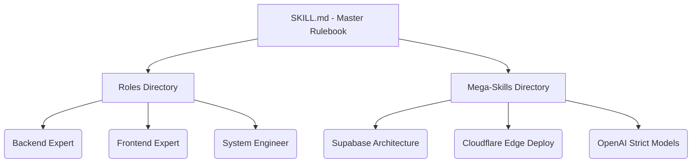

<div align="center">
  
  <br />
  
  <h1>Smart Instructions Library of AI Skill</h1>

  <p>
    <a href="https://www.npmjs.com/package/@harshitj183/ai-skills"></a>
    <a href="https://opensource.org/licenses/MIT"></a>
    <a href="http://makeapullrequest.com"></a>
    
  </p>

  <p><em>The ultimate repository of compressed, high-fidelity AI developer skills.</em></p>
</div>

Welcome to the **Ultimate AI Skill Library**. We analyzed over **1,200+ raw skills** from top official repositories across the globe (*Vercel, Anthropic, HashiCorp, Microsoft, OpenAI, Letta, Composio, Stripe, Supabase*) and compressed them into a perfectly engineered, hyper-specialized vault of **17 Mega-Skills** and **8 Master Roles**.

This library gives your AI agents extreme precision, bypassing general hallucinations entirely, and enforcing industry-standard architecture straight into their context windows.

---

##  Quickstart: The Smart CLI

Our interactive CLI module gives you absolute control over what skills are deployed and auto-configures your IDE.

```bash
npx @harshitj183/ai-skills <command>
```


### Available Commands:
1. **`init`** – Installs the full library quietly by default (perfect for letting your AI agent select skills dynamically).
   - `npx @harshitj183/ai-skills init -i` (Interactive picker)
   - `npx @harshitj183/ai-skills init -r frontend_expert.md -s react_best_practices.md` (CLI filtering)
2. **`configure`** – Auto-detects and writes the rules file for your specific IDE (`.cursorrules`, `.windsurfrules`, `CLAUDE.md`, etc.).
3. **`update`** – Safely pulls the newest official skills from the registry without overwriting your custom skills.
4. **`create <skill_name>`** – Scaffolds a new highly-optimized custom Mega-Skill inside `smart-instructions/custom/`.

---

##  Architecture: What is Included?



### 1. The Core Engine (`SKILL.md`)
The central controller. This file dictates how the AI behaves: commanding aggressive accuracy, strictly typed JSON generation, minimal boilerplate, and routing prompts automatically to the correct roles.

### 2. The 8 Master Roles (`roles/`)
Eliminate the need for extensive prompting. Just tag a role file.
- `backend_expert.md`, `frontend_expert.md`, `gpt5_core.md`, `product_manager.md`, `security_auditor.md`, `technical_writer.md`, `ui_ux_designer.md`, `wisdom_extractor.md`

### 3. The 17 Mega-Skills (`skills/`)
Give your AI absolute technical dominance over specific frameworks.

| Category | Skills Included | Example Technologies |
| :--- | :--- | :--- |
| ** Infrastructure** | `mcp_master.md`, `hashicorp_terraform.md`, `azure_graph_integrator.md`, `antigravity_mastery.md` | Terraform, Azure AD, MCP Servers |
| ** Frontend & Apps** | `react_best_practices.md`, `react_native_performance.md`, `playwright_testing.md`, `tailwind_ux_mastery.md` | React 19, Expo, Playwright, Tailwind CSS |
| ** Backend & APIs** | `supabase_architect.md`, `stripe_integration.md`, `openai_structured_outputs.md` | PostgreSQL, Stripe, OpenAI |
| ** Orchestration** | `composio_integrator.md`, `sanity_architecture.md`, `vercel_cloudflare_deploy.md`, `github_automation.md` | Next.js, Cloudflare, Sanity CMS |
| ** AI Reasoning** | `prompt_reasoning_trees.md`, `letta_agent_memory.md`, `anthropic_documents.md` | Claude, ReAct, Memory Persistence |

---

## 🏛️ AI History Tracking (New!)

Version 2.2.5 introduces a built-in History tracking system. When you initialize the library, it creates a private `history/` folder in your project that allows AI agents to maintain a timeline of their actions, achievements, and technical decisions.


- **`ai_activity_log.md`**: Tracks every task performed by AI.
- **`project_timeline.md`**: High-level roadmap achievements.
- **`milestones.md`**: Key technical breakthroughs.

---

##  Usage Across AI Platforms

Run the installer once in your project root, then configure your preferred AI tool:

```bash
npx @harshitj183/ai-skills init
```

This places all files inside `smart-instructions/` in your project. Your `.gitignore` is automatically updated.

---

###  1. Cursor IDE
Rename `smart-instructions/SKILL.md` to `.cursorrules` at your project root. Every Cursor chat will automatically follow the rules.
```
mv smart-instructions/SKILL.md .cursorrules
```
Or reference individual skills surgically:
> *"@react_best_practices.md implement a new dashboard."*

---

###  2. Claude Code (CLI)
Claude Code auto-reads `CLAUDE.md` from your root. Copy the contents:
```bash
cp smart-instructions/SKILL.md CLAUDE.md
```
Or tell Claude directly: *"Read `smart-instructions/SKILL.md` as your core directive."*

---

###  3. ChatGPT (Web / Custom GPT)
**Option A — Custom Instructions:**
- Go to Settings → Custom Instructions → paste contents of `SKILL.md`

**Option B — Project Knowledge (ChatGPT Plus):**
- Create a new Project → Upload `SKILL.md` and any skill files you need

**Option C — Chat Upload:**
- Attach `SKILL.md` directly to your conversation as a file

---

###  4. GitHub Copilot (VS Code)
Copy instructions to the Copilot-specific file:
```bash
cp smart-instructions/SKILL.md .github/copilot-instructions.md
```
Or reference in chat: *"#file:smart-instructions/react_best_practices.md refactor this component."*

---

###  5. Gemini / Antigravity (Google)
Tell Antigravity: *"Read `smart-instructions/SKILL.md` and act according to the Roles inside."*
Antigravity automatically detects skill files in your workspace.

---

###  6. Windsurf IDE (Codeium)
Windsurf supports `.windsurfrules` file:
```bash
cp smart-instructions/SKILL.md .windsurfrules
```

---

###  7. Zed Editor
Add to Zed's AI assistant context:
- Settings → Assistant → System Prompt → paste `SKILL.md` contents

---

### 8. Cline / Continue.dev (VS Code Extensions)
Place the skill files in `.clinerules` or `.continuerules`:
```bash
cp smart-instructions/SKILL.md .clinerules
```
For Continue.dev, add to `config.json` under `systemMessage`.

---

### 9. Aider (Terminal AI)
```bash
aider --read smart-instructions/SKILL.md
```

---

### 10. Any LLM API (OpenAI, Groq, Mistral, Llama)
Paste `SKILL.md` content as your `system` message in the API call:
```javascript
{ role: "system", content: fs.readFileSync("smart-instructions/SKILL.md", "utf8") }
```

---

## Open Source & Community

We are actively maintaining this library to continuously fuse the latest breakthroughs from top tech teams into single mega-skills. Found a massive repo with a great deployment guide? Compression is welcome! PRs are open.

**License:** MIT

---
⚡ Smart AI Skills Library | Active
