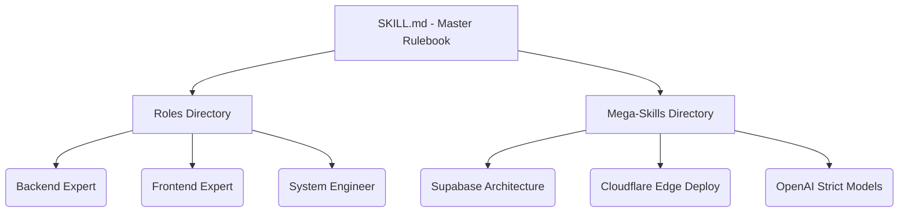

<div align="center">
  
  <h1>Smart Instructions Library of AI Skill</h1>

  <p>
    <a href="https://www.npmjs.com/package/@harshitj183/smart-instructions-library-of-ai-skill"></a>
    <a href="https://opensource.org/licenses/MIT"></a>
    <a href="http://makeapullrequest.com"></a>
  </p>

  <p><em>The ultimate repository of compressed, high-fidelity AI developer skills.</em></p>
</div>

Welcome to the **Ultimate AI Skill Library**. We analyzed over **1,200+ raw skills** from top official repositories across the globe (*Vercel, Anthropic, HashiCorp, Microsoft, OpenAI, Letta, Composio, Stripe, Supabase*) and compressed them into a perfectly engineered, hyper-specialized vault of **17 Mega-Skills** and **8 Master Roles**.

This library gives your AI agents extreme precision, bypassing general hallucinations entirely, and enforcing industry-standard architecture straight into their context windows.

---

##  Quickstart: The Installer

Run our zero-dependency official installer inside any project directory (Next.js, Python, React Native, etc.) to instantly deploy the full library to your workspace.

```bash
npx @harshitj183/smart-instructions-library-of-ai-skill init
```

> **Note for Cursor IDE users:** Move `smart-instructions/SKILL.md` to your project root and rename it to `.cursorrules` to automatically enforce global project rules across all your IDE chats.

---

##  Architecture: What is Included?



### 1. The Core Engine (`SKILL.md`)
The central controller. This file dictates how the AI behaves: commanding aggressive accuracy, strictly typed JSON generation, minimal boilerplate, and routing prompts automatically to the correct roles.

### 2. The 8 Master Roles (`roles/`)
Eliminate the need for extensive prompting. Just tag a role file.
- `backend_expert.md`, `frontend_expert.md`, `gpt5_core.md`, `product_manager.md`, `security_auditor.md`, `technical_writer.md`, `ui_ux_designer.md`, `wisdom_extractor.md`

### 3. The 17 Mega-Skills (`skills/`)
Give your AI absolute technical dominance over specific frameworks.

| Category | Skills Included | Example Technologies |
| :--- | :--- | :--- |
| ** Infrastructure** | `mcp_master.md`, `hashicorp_terraform.md`, `azure_graph_integrator.md`, `antigravity_mastery.md` | Terraform, Azure AD, MCP Servers |
| ** Frontend & Apps** | `react_best_practices.md`, `react_native_performance.md`, `playwright_testing.md` | React 19, Expo, Playwright |
| ** Backend & APIs** | `supabase_architect.md`, `stripe_integration.md`, `openai_structured_outputs.md` | PostgreSQL, Stripe, OpenAI |
| ** Orchestration** | `composio_integrator.md`, `sanity_architecture.md`, `vercel_cloudflare_deploy.md`, `github_automation.md` | Next.js, Cloudflare, Sanity CMS |
| ** AI Reasoning** | `prompt_reasoning_trees.md`, `letta_agent_memory.md`, `anthropic_documents.md` | Claude, ReAct, Memory Persistence |

---

##  Usage Across AI Platforms

You can natively feed this library into major LLM workspace interfaces:

###  1. Cursor IDE
- **Globally:** Run the `npx` command, then rename `SKILL.md` to `.cursorrules`.
- **Surgically:** Type `@` in chat and select what you need.  
  Example Prompt: *"@frontend_expert.md @react_best_practices.md implement a new dashboard navigation."*

###  2. Claude Code (Anthropic CLI)
- Put this library in your root folder. Tell Claude Code: *"Load `SKILL.md` as your core directive."*

###  3. Gemini CLI / Antigravity
- Instruct the Antigravity agent: *"Read `SKILL.md` and act according to the Roles inside."*

###  4. GitHub Copilot (VS Code)
- Copilot chat utilizes active tabs. Keep `azure_graph_integrator.md` open in a read-only tab, and ask: *"#file:azure_graph_integrator.md build a new AD token script."*

###  5. ChatGPT / Claude Web (Pro)
- Upload `SKILL.md` into standard "Custom Instructions" / "Project Knowledge", and attach individual mega-skill files alongside your main prompt.

---

## Open Source & Community

We are actively maintaining this library to continuously fuse the latest breakthroughs from top tech teams into single mega-skills. Found a massive repo with a great deployment guide? Compression is welcome! PRs are open.

**License:** MIT
