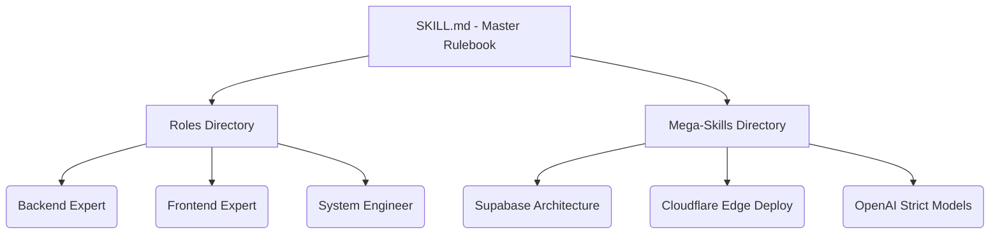

# 🧠 Smart Instructions Library of AI Skill

[](https://www.npmjs.com/package/smart-instructions-library-of-ai-skill)
[](https://opensource.org/licenses/MIT)
[](http://makeapullrequest.com)

Welcome to the **Ultimate AI Skill Library**. We analyzed over **1,200+ raw skills** from top official repositories across the globe (*Vercel, Anthropic, HashiCorp, Microsoft, OpenAI, Letta, Composio, Stripe, Supabase*) and compressed them into a perfectly engineered, hyper-specialized vault of **17 Mega-Skills** and **8 Master Roles**.

This library gives your AI agents extreme precision, bypassing "hallucinations" entirely, and enforcing industry-standard architecture straight into their context windows.

---

## ⚡ Quickstart: The Magic Command

Don't clone. Don't waste time. Run our zero-dependency official installer inside any project directory (Next.js, Python, React Native, etc.):

```bash
npx smart-instructions-library-of-ai-skill init
```

*What this does:* In exactly 1.2 seconds, it instantly injects the entire `SKILL.md` master rulebook, the 8 `roles/`, and all 17 `skills/` directly into your workspace.

*(🚀 **Pro Tip for Cursor:** Just rename the copied `SKILL.md` to `.cursorrules` and watch your AI transform instantly!)*

---

## 🧩 Architecture: What's Inside?



### 1. The Core Engine (`SKILL.md`)
The brain of the operation. This file dictates how the AI behaves: commanding aggressive accuracy, strictly typed JSON generation, minimal boilerplate, and routing prompts automatically to the right roles.

### 2. The 8 Master Roles (`roles/`)
You don't need to write long prompts anymore. Just tag a role.
- `backend_expert.md`, `frontend_expert.md`, `gpt5_core.md`, `product_manager.md`, `security_auditor.md`, `technical_writer.md`, `ui_ux_designer.md`, `wisdom_extractor.md`

### 3. The 17 Mega-Skills (`skills/`)
Give your AI absolute technical dominance over specific frameworks.
- **☁️ Infrastructure:** `mcp_master.md`, `hashicorp_terraform.md`, `azure_graph_integrator.md`, `antigravity_mastery.md`
- **⚛️ Frontend & Apps:** `react_best_practices.md`, `react_native_performance.md`, `playwright_testing.md`
- **💾 Backend & APIs:** `supabase_architect.md`, `stripe_integration.md`, `openai_structured_outputs.md`
- **orchestrator Orchestration:** `composio_integrator.md`, `sanity_architecture.md`, `vercel_cloudflare_deploy.md`, `github_automation.md`
- **🧠 AI Reasoning:** `prompt_reasoning_trees.md`, `letta_agent_memory.md`, `anthropic_documents.md`

---

## 🛠️ Usage Across AI Platforms

You can natively feed this library into **any** major LLM workspace interface:

### 🟢 1. Cursor IDE
- **Globally:** Run the `npx` command, then rename `SKILL.md` to `.cursorrules`. You are done.
- **Surgically:** Type `@` in chat and select what you need: *"@frontend_expert.md @react_best_practices.md implement a new dashboard navigation."*

### 🟣 2. Claude Code (Anthropic CLI)
- Put this library in your root folder. Tell Claude Code: *"Load `SKILL.md` as your core directive."*

### 🌌 3. Gemini CLI / Antigravity
- Instruct the Antigravity agent: *"Read `SKILL.md` and act according to the Roles inside."*

### 🔵 4. GitHub Copilot (VS Code)
- Copilot chat utilizes active tabs. Keep `azure_graph_integrator.md` open in a read-only tab, and ask: *"#file:azure_graph_integrator.md build a new AD token script."*

### 🟠 5. ChatGPT / Claude Web (Pro)
- Upload `SKILL.md` into standard "Custom Instructions" / "Project Knowledge", and attach individual mega-skill files alongside your main prompt.

---

## 🌐 Open Source & Community

We are actively maintaining this library to continuously fuse the latest breakthroughs from top tech teams into single mega-skills. Found a massive repo with a great deployment guide? Compression is welcome! PRs are open.

**License:** MIT
