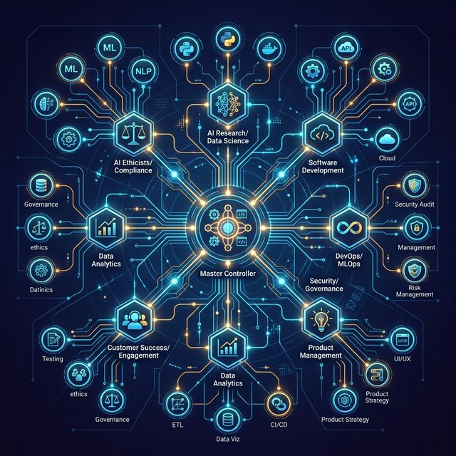

# 🏗️ System Architecture

The Smart AI Skills Library is built on a hierarchical architecture that allows AI agents to scale their technical competence across millions of lines of code without getting overwhelmed.

## 1. The Core Controller (`SKILL.md`)
At the heart of every project is the `SKILL.md` master rulebook. It acts as the "Brain" of the library, enforcing:
- **Strict Logic**: No more "maybe" answers. The AI is commanded to be direct and precise.
- **Architectural Integrity**: Ensures code follows the selected MEGA-SKILL principles (e.g., Supabase, React 19, etc.).
- **Automatic Routing**: Directs prompts to the right MASTER ROLE files.

## 2. Master Roles (`/roles`)
These files define the *personality* and *competence* of the agent. By referencing a role, you instantly change the AI's internal persona (e.g., "Think like a Security Auditor").

## 3. Mega-Skills (`/skills`)
These are highly compressed technical guides for specific stacks. They contain "The One Source of Truth" for complex implementations, eliminating documentation lookups for the AI.

## 4. History System (`/history`)
The latest innovation in v2.2.5. Every AI intervention is recorded, creating a persistent memory for the project that survives across sessions and different chat agents.

---
*Maintained by: AI Skills History System*
