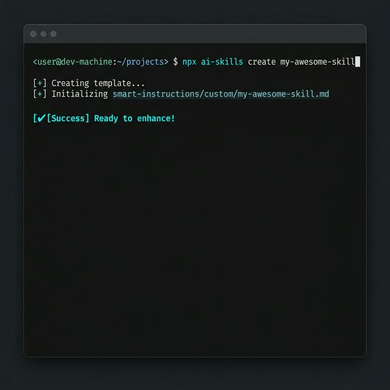

# 🛠️ CLI Power User Guide

The Smart AI Skills CLI is designed for speed and precision. Here's a breakdown of every command and how to maximize their potential.

## 1. **`init`** (The Deployment)
This command sets everything up. While the default `init` is quiet, we recommend using the **Interactive Mode** for total control.

```bash
npx @harshitj183/ai-skills init -i
```
- **Silent Mode**: `npx @harshitj183/ai-skills init` (Quickest way to 17 Mega-Skills).
- **Manual Filter**: `npx @harshitj183/ai-skills init -r backend_expert.md -s postgres_optimization.md`.


## 2. **`configure`** (The IDE Bridge)
This command auto-detects what IDE you are using (Cursor, VS Code, Windsurf, Claude Code) and writes the appropriate configuration file (`.cursorrules`, `CLAUDE.md`, etc.).

## 3. **`update`** (The Synchronization)
Keep your project's skills up-to-date with the latest official breakthroughs while **preserving your custom skills** in the `/custom/` directory.

## 4. **`create`** (The Scaffolding)
Quickly create a new, perfectly structured Mega-Skill or Master Role. This scaffolds the file with high-fidelity logic blocks ready for your specifics.

```bash
npx @harshitj183/ai-skills create my-custom-skill
```



---
*Maintained by: AI Skills History System*
