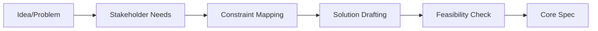
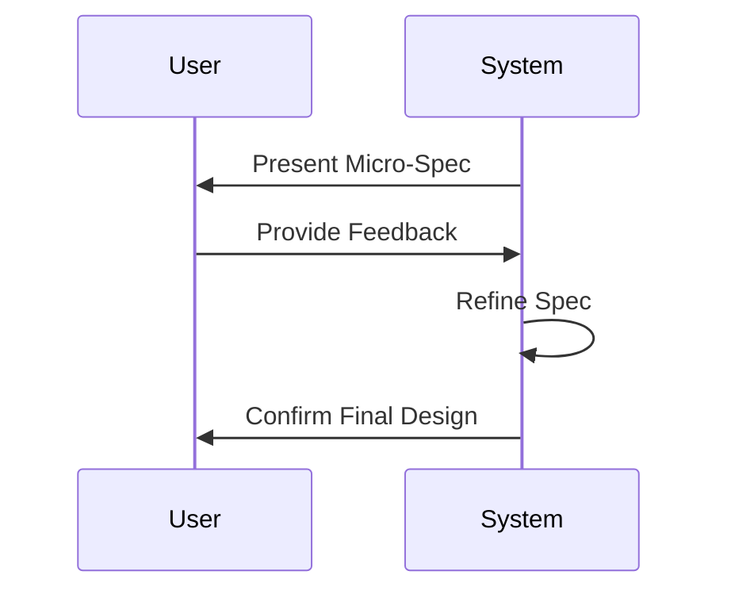
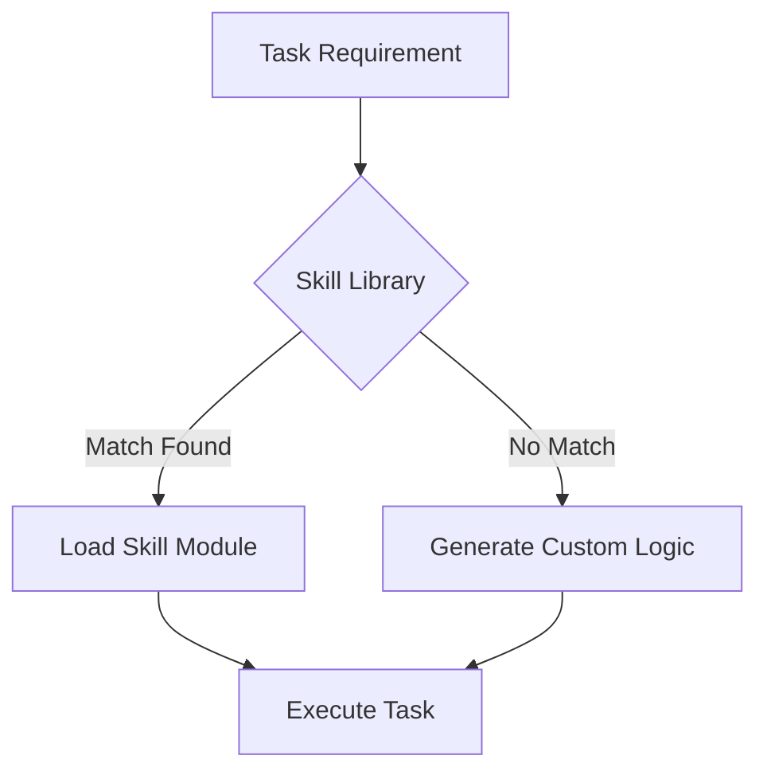

# 1. Ideation Flow

# 1. Protocol Logic
When a user provides a raw idea or a vague request:
- **Challenge Assumptions**: Ask "Why?" and "What is the core user pain point?".
- **Constraint Identification**: List what is NOT being built.
- **Architectural Mapping**: Determine which `roles/` and `skills/` from the library will be needed for this feature.

# 2. Review Protocol

# 3. External Skill Retrieval

# 4. Output: The Micro-Spec
- **Goal**: One sentence.
- **Features**: Bullet list of MUST-HAVEs.
- **Edge Cases**: Identify 3-5 failure modes.
- **Plan**: Hand-off to `skills/orchestration/plan_architect.md`.

# 3. Collaborative Loop
- Present the Micro-Spec to the user.
- Incorporate one round of feedback.
- Confirm final design before implementation.

---
⚡ Smart AI Skills Library | v2.2.8 | Active
