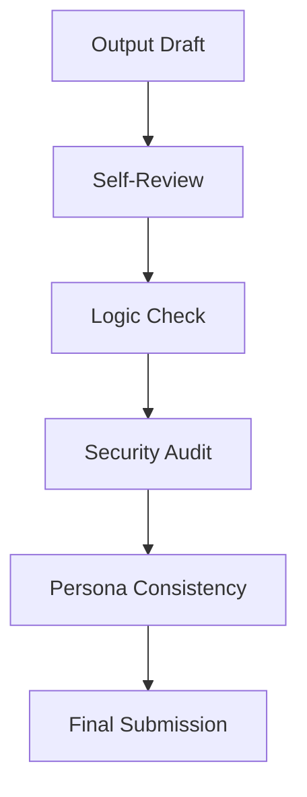

# 1. Review Flow

# 1. Review Request Logic
When requesting review (from a human or another AI):
- **PR Summary**: List changed files and their logical impact.
- **Critical Points**: Explicitly point out complex logic or sensitive changes.
- **Context Pack**: Provide the `SKILL.md` rules and the current `status_summary.md` as context.

# 2. Receiving Review Logic
When processing feedback:
1. **Analyze**: Categorize by Impact (Critical, Minor, Nit).
2. **Respond**: Acknowledge each point and provide the reasoning behind the fix.
3. **Fix**: Use the `tdd_mastery.md` skill to safely implement any changes.
4. **Verify**: Run the full test suite again.

# 3. Quality Metrics
- Zero-defect code.
- No regression.
- Performance impact <1%.

---
⚡ Smart AI Skills Library | v2.2.8 | Active
