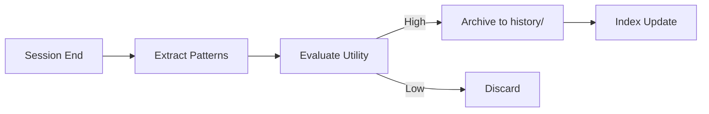

# 1. Memory Workflow



# 1. Trigger Condition
Activate this skill when:
- A complex task is completed (e.g., successful bug fix after multiple attempts).
- A new "Best Practice" or "Gotcha" is discovered for a specific technology.
- The user expresses a strong preference for a specific style or logic pattern.

# 2. Archival Protocol
1. **Identify the Core**: Extract the specific logic or pattern that worked.
2. **Standardize**: format the insight as a "Lesson Learned".
3. **Persist**: 
   - Append to `history/lessons.md` OR create a new file in `history/patterns/`.
   - Update `history/ai_activity_log.md` with the archival event.
4. **Cleanup**: Clear the transient session memory of redundant details while keeping the "Pointer" to the archived history.

# 3. Lesson format
```markdown
## [Tech/Skill] - [Title]
- **Date**: YYYY-MM-DD
- **Context**: Problem description.
- **Solution**: The specific pattern that worked.
- **Why**: Rationale for why this is the preferred approach.
```

# 4. Success Criteria
- Future sessions can refer to `history/` to avoid repeating errors.
- The library "grows" smarter with every interaction.

---
⚡ Smart AI Skills Library | v2.2.8 | Active
