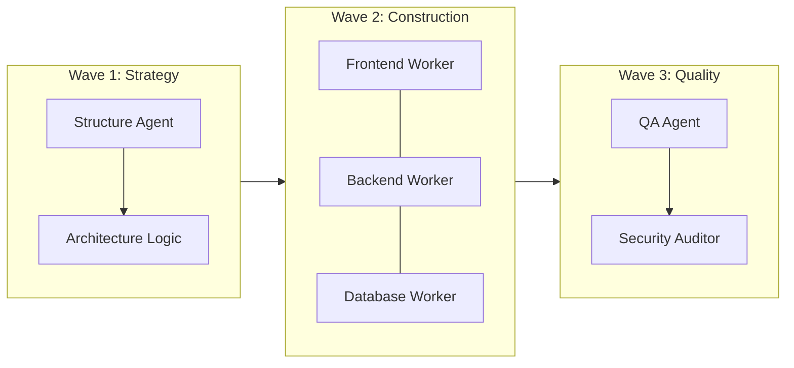

# 1. Wave Execution Protocol
Complex tasks must be broken into **Synchronous Waves** to prevent state pollution.

# 2. Inter-Agent Communication (Bus)
- **State Bucket**: Agents must write their progress to a shared `scratch/wave_output.json`.
- **Gating**: Wave 2 cannot start until Wave 1 results pass the **Coordinator's** validation.

# 3. Role Allocation
- **Worker A**: Implementer (Code generation).
- **Worker B**: Adversary (Edge cases and failure testing).
- **Worker C**: Refiner (Design polish and documentation).

# 4. Resource Gating
- Limit each agent to 3 specific file scopes to avoid context overflow.
- All code must pass `tests/validate_skills.py` before Wave 3 completion.

---
⚡ Smart AI Skills Library | v2.2.8 | Active
