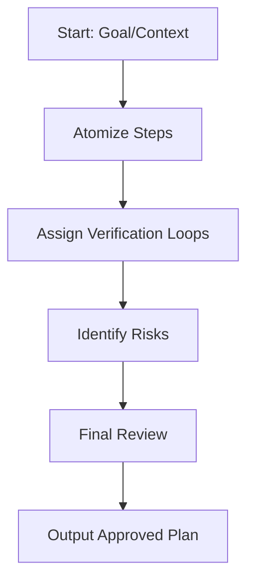

# 1. Blueprint Standards

Every implementation plan MUST be:
- **Atomized**: Each step must be a single, non-divisible action.
- **Context-Bound**: Explicitly list all files and documentation needed for each step.
- **Verified**: Define the "definition of done" for every single step.

# 2. Plan Structure
1. **Objective**: One-sentence goal.
2. **Context**: List files/URIs with line numbers for reference.
3. **Execution Steps**: Numbered list with clear, testable outputs.
4. **Risk Map**: Identify potential pitfalls (e.g., breaking changes, performance bottlenecks).

# 3. Validation Logic
- Before finishing a plan, perform a "mental dry run" to ensure no step depends on an unlisted resource or missing tool.

---
⚡ Smart AI Skills Library | v2.2.8 | Active
