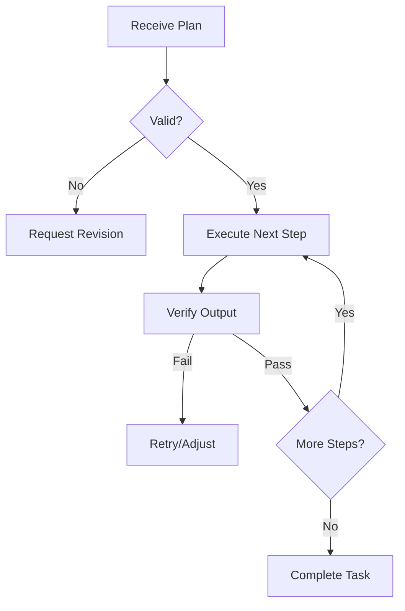

# 1. Implementation Protocol
- **Zero Drift**: Follow the plan exactly. Do NOT improve, change, or skip any step unless it is logically impossible.
- **Progress Reporting**: Check off each step as you complete it. Use the `history/` system for tracking.

# 2. Execution Protocol

# 3. Execution Logic
1. **Initialize**: Load all files listed in the step's "Context" first.
2. **Execute**: Perform the code change or terminal command.
3. **Verify**: Run a test or manual check as per the definition of done.
4. **Finalize**: Commit the step's history and move to the next.

# 3. Branching/Error Logic
- If a step fails, **pause**. Do not try to workaround. Update the plan's Risk Map and inform the Coordinator/User.

---
⚡ Smart AI Skills Library | v2.2.8 | Active
