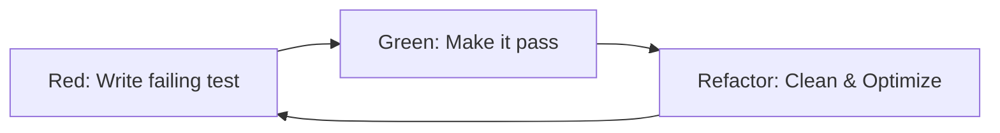

# 1. The Red-Green-Refactor Cycle
Every code change MUST follow this exact sequence:

# 2. Strict Standards
- **Isolation**: Each test should verify a single unit of logic.
- **Mocking**: Use standard mocking for external dependencies (DBs, APIs).
- **Naming**: Tests should read like documentation (e.g., `test_should_reject_invalid_email`).

# 3. Execution Protocol
1. **Red**: Run the test suite first; it must fail with a specific, expected error.
2. **Green**: Implement the *minimal* code to make that exact test pass. Avoid "future-proofing".
3. **Refactor**: Only after passing can you clean up the code. Ensure the test remains green.

# 4. Success Criteria
- Test coverage for all logical branches.
- No "side-effects" in tests.
- Clear, readable assertions.

---
⚡ Smart AI Skills Library | v2.2.8 | Active
